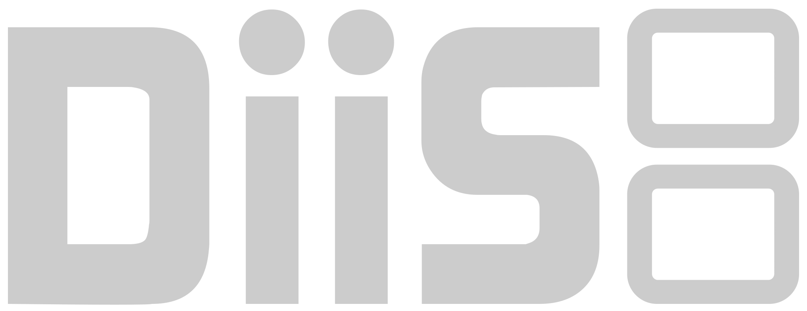

<p align="center">
  
</p>

# DiiS
DiiS is a homebrew DS emulator based on the original port of [DeSmuMEWii](https://github.com/bd452/desmumewii) but with significant preformance gains. Preformance still is not 100% but has improved significatly to the point I think a pre-release is justified ([See breakdown]()). Also compatable with GBA games. 

## Requirements
 
- A Wii with the Homebrew Channel installed, or Dolphin
  with a Wii SD card configured
- An SD card (or attached USB storage)
- Your own legally-dumped DS ROM(s)
- Your own DS BIOS and firmware dumps (optional, improved compatability) 
- GBA BIOS dumps (optional, improved compatability) 

## Features
- Nintendo DS emulation with ARM7 and ARM9 JIT recompilers
- Hardware-accelerated 3D rendering on the Wii GPU
- GBA slot-2 passthrough with its own JIT (for GBA-linked DS titles)
- Save states, battery saves, and cheat code support
- Wiimote, Nunchuk, Classic Controller, and GameCube controller input
- [Advance Input Expansion Pak](#advance-input-expansion-pak)

## Planned Features
- Per-Game settings
- Better UI
- Enhanced 3D resolution options
- Better overall preformance
- Prebuilt Channel WAD
- Setup wizard for virtual console style channels 

## Installation
 
1. Copy the built `.dol` (or `.elf`) onto your SD card, e.g.
   `sd:/apps/diis/boot.dol`, so the Homebrew Channel can find it. If you're
   running under Dolphin instead of real hardware, point Dolphin at the
   `.dol`/`.elf` directly (see `run.sh` for a scripted example using the
   Dolphin flatpak).
2. Create the following folders on the SD card root:
```
   sd:/DS/ROMS/   - your .nds ROM files go here
   sd:/DS/BIOS/   - biosnds7.rom and biosnds9.rom go here
   sd:/DS/SAVES/  - battery saves and save states are written here
```
 
3. Drop your ROM(s) into `sd:/DS/ROMS/`. If you have real DS BIOS dumps,
   name them exactly `biosnds7.rom` and `biosnds9.rom` and place them in
   `sd:/DS/BIOS/`. Without them, DiiS falls back to internal HLE BIOS/firmware,
   which works for most games but not all.
4. If your storage is a USB device rather than an SD card, use the same
   folder layout under `usb:/DS/...` instead.

## Usage
 
### Starting a game
 
On launch, DiiS asks whether to use the SD card or USB storage, then opens a
file browser rooted at `DS/ROMS` on whichever device you picked. The browser
only lists folders and `.nds` files.
 
| Action | Control |
|---|---|
| Move selection | D-pad / left stick Up / Down |
| Jump to top / bottom of list | D-pad / left stick Left / Right |
| Open folder / select ROM | A |
| Cancel / back out | HOME (Wiimote) or Z (GameCube) |
 
### In-game controls
 
Default mapping (Classic Controller shown; GameCube controller mirrors A/B/X/Y,
L/R, Start, and Select):
 
| DS button | Wiimote (Classic Controller) | GameCube controller |
|---|---|---|
| A / B / X / Y | A / B / X / Y | A / B / X / Y |
| D-Pad | D-Pad | Control stick / D-pad |
| L / R | Full L / Full R | L / R trigger |
| Start / Select | Plus / Minus | Start / D-pad Right |
 
Touch screen input is handled with the Wiimote IR pointer (or the GameCube
controller's equivalent, where mapped).
 
### Hotkeys
 
| Function | Control |
|---|---|
| Quick-save state (slot 0) | Hold Z, tap L (GameCube controller) |
| Quick-load state (slot 0) | Hold Z, tap R (GameCube controller) |
| Toggle debug console | Wiimote button 1 / D-pad Left |
| Toggle screen layout | Wiimote button 2 / D-pad Up |
| Toggle cursor display | Wiimote B / D-pad Right |
| Adjust frame skip | Wiimote Plus / Minus |
| Quit to loader | HOME, or Z + L + R together (GameCube controller) |
 
### Notes
 
- There is currently no in-game settings menu - control remapping, BIOS
  paths, and similar options are set at compile time or by editing the SD card layout above.
- Save states and battery saves are written to `sd:/DS/SAVES/` (or the
  equivalent `usb:/` path).


## Advance Input Expansion Pak
This addition was mostly for the sake of my own homebrew plans. It is an entirely fictional Slot-2 (GBA slot) accessory which gives full modern controller input for the Nintendo DS. That includes:
- Controller type flags
- All default DS inputs
- Dual Analog Joysticks
- Joystick presses
- Analog Triggers
- Rumble (through in-built compatability with RumblePak)

## License/Credations
 
DiiS is free software, licensed under the GNU General Public License v2 - see `LICENSE.txt`. It builds on DeSmuME and DeSmuMEWii, and vendors a
JIT derived from Visual Boy Advance GX (see
`source/jit/upstream/PROVENANCE.md` for details and attribution).
